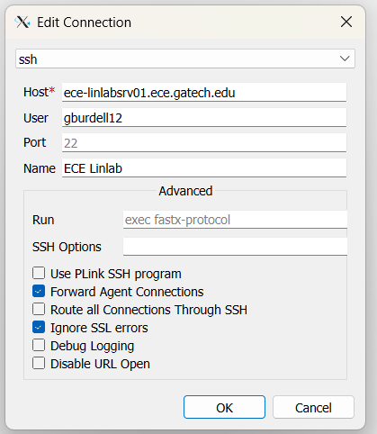
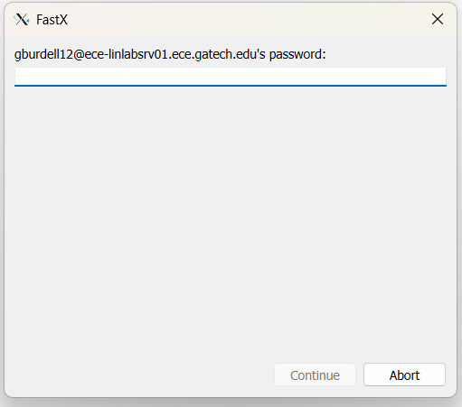
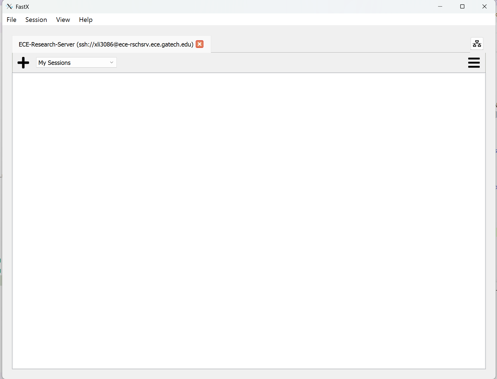
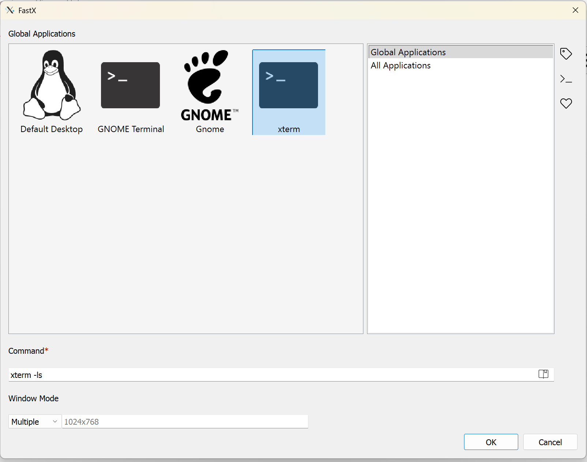
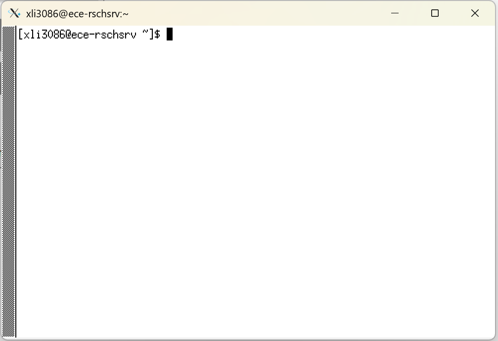

# Connecting to ECE Servers
The GT ECE department offers licensed software such as Cadence, Silvaco, Synopsys, etc. on an open server that is accessible to all GT ECE students as long as you are enrolled in an ECE class. The server is intended to be connected to remoted through through X11 forwarding over SSH, and this page will show you how to do it on the three most common operating systems.

The licenses are also available on the PCs in Klaus 1448 during weekdays, so you can consider them if you cannot connect to the server remotely. Note that any processes found running on these local machines for longer than 8 hours will be terminated.

## Available Servers/Machines
!!! warning "Items to Note"

    Temporary files and directories more than two weeks old on these machines are deleted daily (/usr/scratch). Jobs are limited to a total of two interactive or background process per login across all of the machines listed below. Accounts found running more than this may be subject to termination of their background processes or login session at the discretion of the CSG. Flagrant or repeated violations may in extreme cases be subject to suspension or revocation of account privileges.

- ece-linlabsrv01.ece.gatech.edu
    - For academic and classroom labs
    - Max process run time of 8 hours
- ece-rschsrv.ece.gatech.edu
    - For research
    - Need to have advisor approval and sign EULA
- ece-linlab01.ece.gatech.edu - ece-linlab26.ece.gatech.edu
    - Local machines in Klaus 1448

## GT VPN
To securely connect to the ECE servers and machines, you must be connected to the GT virtual private network (VPN). Note that you cannot use the web VPN and must install the GlobalProtect software. To install the VPN, go to [OIT's VPN Service](https://vpn.gatech.edu/){ target = "_blank } and follow the instructions there.

## Windows
1. Install the [FastX client](https://starnet.com/download/fastx-client){ target = "_blank" }, a software to establish an SSH connection on Windows.
2. Login on the local GlobalProtect VPN software with your GT credentials. You will need to do 2FA with DUO, so keep your phone around. Once you have successfully connected, the globe icon should be blue.
3. Open FastX and click the plus sign to add a new connection. Fill out the pop-up form as shown. The following example shows a connection to the LinLabs server; simply switch the "Host" field for a different server/machine. For user, use your GT username.

4. Click the new entry, then enter your GT password in the following pane.

5. Upon a successful login, you will see a window for managing sessions, as shown below.

6. Click the plus sign, then select "xterm" and click "OK".

7. You're done! Now you should see a window with a terminal. This terminal allow you to run commands on the server to launch applications. Note that all servers has a RHEL OS, so familiarize yourself with Linux commands in order to use the tool effectively.

## MacOS
!!! warning "Work in Progress"
    Need someone with a MacOS computer to write the steps

## Linux
!!! warning "OS Compatibility"
    Because GT's GlobalProtect VPN only supports Ubuntu, the only flavor of Linux that can be used to reliably access the ECE servers/machines is Ubuntu.

1. Login on the local GlobalProtect VPN software with your GT credentials. You will need to do 2FA with DUO, so keep your phone around. Once you have successfully connected, the globe icon should be blue.
2. Open a terminal and run `ssh -Y gburdell12@ece-linlabsrv01.ece.gatech.edu`.
3. You're done! And since you already use Linux as you day-to-day OS, you know what to do.